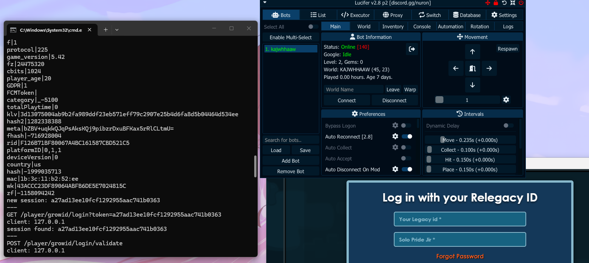

### Relegacy
Bringback Grow Legacy login System!

## About The Project

There are many login methods available for ltoken, Google login, Apple ID but let's be honest, they're all pretty boring and overly complex. I wanted to do something different, something creative.

Instead of forcing users through complicated OAuth flows or token management, Relegacy brings back the simplicity: **just username and password**. That's it. Everything else token generation, session management, checktoken handling is processed seamlessly in the backend. No hassle, no complexity.

Built with **Node.js** for high performance and stability, this project proves that simple can still be powerful. The server handles all the heavy lifting while you enjoy a clean, straightforward login experience.


## Features

- [x] Auto update following the game client (using client clientData)
- [x] Social login Token G login
- [x] Session refresh
- [x] Ltoken Validate
- [ ] Adding Socks5 Support 
- [ ] Apple login Social Login 
- [ ] enet connect for better token validation

### 📜 Installation
1.  **Install Dependencies**  
    Run `npm install` in the terminal.
2.  **Configure Environment**  
    - Copy `example.env` as template and rename to `.env` in root folder.
    - Create `.env` in `apiserver/` folder with MongoDB URI.
    - Fill in your configuration values.
3.  **Install Certificate** (Important!)  
    - Find `install-cert.bat` in the folder.
    - Right-click and **Run as Administrator**.
    - This will trust the self-signed certificate so Growtopia accepts the connection.

### 🚀 Usage
1.  Start the API Database:
    ```bash
    node apiserver/apiserver.js
    ```
2.  Start the Main Server:
    ```bash
    node server.js
    ```
3.  Set your `hosts` file to point `login.growtopiagame.com` to `127.0.0.1`.

dont know where hosts exit? `C:\Windows\System32\drivers\etc`

### ⚠️ Disclaimer
This project is for educational purposes only. Use at your own risk.

Relegacy is a project made for educational purposes.
